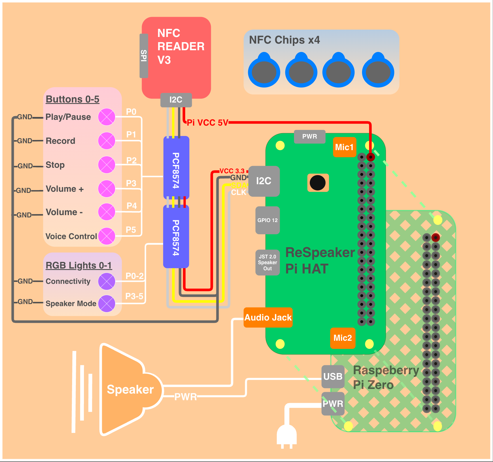

# Smart Speaker - Raspberry Pi IoT Project

A smart speaker system that uses NFC chips to trigger music playback. Scan an NFC tag to instantly play songs from Spotify or local files, record voice memos, and control playback through physical buttons, voice commands, or a companion mobile app.

## Team Members

| Name | Role | Responsibilities |
|------|------|------------------|
| Daniella Shimon | Project Manager | Project planning, Flutter app development, testing, integration & deployment |
| Zohar Shtamberg | Tech Lead | System architecture, Raspberry Pi setup, hardware drivers (NFC, buttons, LEDs), Mopidy audio integration |
| Shiri Perechodnic | Creative Lead | 3D enclosure design, poster design, visual presentation |

---

## Features

| Feature | Description | Status |
|---------|-------------|--------|
| NFC Playback | Scan NFC tags to instantly play associated music | ✅ Done |
| Multiple Audio Sources | Spotify tracks and local files via Mopidy | ✅ Done |
| Voice Recording | Record audio clips and save to chips | ✅ Done |
| Physical Buttons | Play/Pause, Record, Stop, Volume, PTT controls | ✅ Done |
| Mobile App | Flutter app for chip and library management | ✅ Done |
| Audio Feedback | Sound effects for all interactions | ✅ Done |
| Parental Controls | Volume limits, quiet hours, chip whitelist | ✅ Done |
| PTT Voice Commands | Press-to-talk voice control (play, pause, stop) | ✅ Done |
| Developer Tools | Remote logs, service management, git operations | ✅ Done |
| Service Architecture | Separate server and hardware services | ✅ Done |
| WiFi Provisioning | AP mode fallback + app-based WiFi management | ✅ Done |
| Health Monitor | LED status indicators + health API | ✅ Done |

---

## Hardware Components

### Bill of Materials (BOM)

| Component | Model/Specs | Quantity | Purpose |
|-----------|-------------|----------|---------|
| Raspberry Pi | Raspberry Pi 4/5 | 1 | Main controller |
| Audio HAT | ReSpeaker 2-Mic Pi HAT | 1 | I2C hub, audio output, microphone input |
| NFC Reader | PN532 (I2C mode) | 1 | Read NFC chip UIDs |
| I/O Expander | PCF8574 | 2 | Button input (0x20) + LED output (0x21) |
| RGB LEDs | Common cathode 5mm | 3 | Health, PTT, and Speaker status indicators |
| Push Buttons | Momentary tactile | 6 | Play/Pause, Record, Stop, Vol+, Vol-, PTT |
| Speaker | USB-powered speaker | 1 | Audio output (via 3.5mm jack) |
| NFC Tags | NTAG213/215 | 4 | Music trigger chips |
| Power Supply | 5V 3A USB-C | 1 | Raspberry Pi power |

### I2C Addresses

All I2C devices connect via the ReSpeaker Pi HAT's I2C breakout pins.

| Device | Address | Description |
|--------|---------|-------------|
| PCF8574 (Buttons) | 0x20 | 6-button input + Speaker LED red pin |
| PCF8574 (LEDs) | 0x21 | RGB LED controller (3 LEDs) |
| PN532 NFC | 0x24 | NFC reader module |

---

## Wiring Diagram



**System Architecture:**
```
┌─────────────────┐
│  Raspberry Pi   │──USB──→ Speaker Power
│                 │──5V───→ PN532 NFC VCC
└────────┬────────┘
         │ (GPIO header)
┌────────┴────────┐
│ ReSpeaker PiHAT │──3.5mm──→ Speaker Audio
│                 │
│  Built-in Mic   │ (for voice recording & PTT)
│                 │
│  SDA, CLK, GND  │──→ All I2C devices
│                 |
|  3.3V           │──→ PCF8574 power
└────────┬────────┘
         │
    ┌────┴────┬─────────────┐
    ↓         ↓             ↓
 PN532    PCF8574(0x20)  PCF8574(0x21)
  NFC      Buttons         LEDs
```


**Power Connections:**
```
Raspberry Pi    →    Device
5V (GPIO pin)   →    PN532 NFC Reader VCC (requires 5V)
USB port        →    Speaker power

ReSpeaker HAT   →    Device
3.3V            →    PCF8574 (buttons) VCC
3.3V            →    PCF8574 (LEDs) VCC
```

**Audio Connections:**
```
ReSpeaker HAT   →    Device
3.5mm Jack      →    Speaker audio input
Built-in Mic    →    Voice recording & PTT commands
```

> **Note:** The ReSpeaker Pi HAT sits on top of the Raspberry Pi and provides I2C breakout, audio output via 3.5mm jack, and built-in microphones.

**PCF8574 @ 0x20 (Buttons) Pin Mapping:**
```
P0 → Play/Pause button
P1 → Record button
P2 → Stop button
P3 → Volume Up button
P4 → Volume Down button
P5 → PTT (Push-to-Talk) button
P6 → Speaker LED Red (divided LED)
P7 → (unused)
```

**PCF8574 @ 0x21 (LEDs) Pin Mapping:**
```
Pin order: Blue, Green, Red (B, G, R)

Light 1 - Health LED:
P0 → Health Blue
P1 → Health Green
P2 → Health Red

Light 2 - PTT LED:
P3 → PTT Blue
P4 → PTT Green
P5 → PTT Red

Light 3 - Speaker LED (divided across expanders):
P6 → Speaker Blue
P7 → Speaker Green
(Red on P6 of 0x20 - see above)
```

---

## Project Poster

<!-- TODO: Add project poster image -->
<!-- Upload your poster to assets/ and uncomment below -->

<!--  -->

---

## Repository Structure

```
IOT-project--Smart-Speaker/
│
├── Main/                        # Python backend (Raspberry Pi)
│   ├── main.py                  # Hardware controller entry point
│   ├── server.py                # REST API server
│   ├── server_main.py           # Server standalone entry
│   ├── health_monitor.py        # Health LED service
│   ├── wifi_provisioner.py      # WiFi AP fallback mode
│   ├── core/                    # State machine & actions
│   │   ├── controller.py        # Main hardware controller
│   │   ├── actions.py           # Playback action handlers
│   │   └── state.py             # State management
│   ├── hardware/                # Hardware drivers
│   │   ├── nfc_scanner.py       # PN532 NFC reader
│   │   ├── buttons.py           # PCF8574 button handler
│   │   ├── leds.py              # PCF8574 LED controller
│   │   ├── audio_player.py      # Mopidy MPD client
│   │   ├── recorder.py          # Audio recording
│   │   └── voice_command.py     # PTT speech recognition
│   ├── ui/                      # User feedback
│   │   ├── sounds.py            # Sound effect player
│   │   └── lights.py            # LED patterns
│   ├── config/                  # Configuration
│   │   ├── settings.py          # Hardware parameters
│   │   ├── paths.py             # File paths
│   │   └── tags.json            # NFC chip mappings
│   └── assets/sounds/           # Audio feedback files
│
├── flutter_app/                 # Mobile companion app (Flutter/Dart)
│   ├── lib/
│   │   ├── main.dart            # App entry point
│   │   ├── screens/             # UI screens
│   │   │   ├── home_screen.dart
│   │   │   ├── chips_screen.dart
│   │   │   ├── library_screen.dart
│   │   │   ├── parental_controls_screen.dart
│   │   │   └── developer_tools_screen.dart
│   │   ├── services/            # API & utilities
│   │   │   ├── api_service.dart
│   │   │   └── spotify_utils.dart
│   │   └── models/              # Data models
│   ├── android/                 # Android build config
│   ├── pubspec.yaml             # Flutter dependencies
│   └── assets/                  # App assets (fonts)
│
├── services/                    # Systemd service files
│   ├── smart_speaker.service           # Hardware controller
│   ├── smart_speaker_server.service    # REST API server
│   ├── smart_speaker_health.service    # Health monitor
│   ├── smart_speaker_wifi.service      # WiFi provisioner
│   └── copy-and-enable-service.sh      # Installation script
│
├── Unit-tests/                  # Hardware component tests
│   ├── test_pn532.py            # NFC reader test
│   ├── test_rgb_lights.py       # LED test
│   ├── button.py                # Button test
│   ├── health_check.py          # System health test
│   ├── read_card.py             # NFC card reading test
│   └── rfid-chip-test/          # ESP32 RFID test (PlatformIO)
│
├── scripts/                     # Utility scripts
│   ├── install-ptt-deps.sh      # PTT dependencies installer
│   └── test-ptt.py              # PTT functionality test
│
├── README.md                    # This file
├── PARAMETERS.md                # Hardcoded parameters documentation
├── SECRETS.template             # Credentials template (fill in your values)
├── requirements.txt             # Python dependencies
└── USER_STORIES.md              # User stories and requirements
```

---

## Software Dependencies

### Raspberry Pi (Python 3.7+)

All dependencies are listed in `requirements.txt`. Key libraries:

| Library | Version | Purpose |
|---------|---------|---------|
| adafruit-circuitpython-pn532 | 2.4.6 | PN532 NFC reader driver |
| smbus2 | 0.5.0 | I2C communication |
| python-mpd2 | 3.1.1 | Mopidy MPD client |
| RPi.GPIO | 0.7.1 | GPIO access |
| SpeechRecognition | 3.10.0+ | PTT voice commands |
| requests | 2.32.5 | HTTP client |
| Adafruit-Blinka | 8.68.0 | CircuitPython compatibility |

### System Requirements

| Software | Version | Purpose |
|----------|---------|---------|
| Raspberry Pi OS | Bookworm (64-bit) | Operating system |
| Python | 3.7+ | Runtime |
| Mopidy | 3.4+ | Music server |
| NetworkManager | 1.42+ | WiFi provisioning |

### Flutter App

Dependencies in `flutter_app/pubspec.yaml`:
- Flutter SDK 3.x
- http package for REST API
- Material Design 3

---

## Installation

### Prerequisites

- Raspberry Pi with I2C enabled (`sudo raspi-config` → Interface Options → I2C)
- Mopidy music server installed and configured
- Python 3.7+
- NetworkManager (for WiFi provisioning)

### Quick Start

```bash
# Clone repository
git clone <repo-url>
cd IOT-project--Smart-Speaker

# Install Python dependencies
pip3 install -r requirements.txt

# Install PTT voice command dependencies
cd scripts && ./install-ptt-deps.sh && cd ..

# Copy secrets template and fill in your values
cp SECRETS.template SECRETS
nano SECRETS  # Edit with your credentials

# Start Mopidy
sudo systemctl start mopidy

# Run manually (for testing)
cd Main && python3 main.py
```

### Service Installation

```bash
# Install all services
cd services
sudo ./copy-and-enable-service.sh

# Or install individually:
sudo cp smart_speaker*.service /etc/systemd/system/
sudo systemctl daemon-reload
sudo systemctl enable smart_speaker_server smart_speaker smart_speaker_health
sudo systemctl start smart_speaker_server smart_speaker smart_speaker_health
```

### Sudoers Configuration

Add to `/etc/sudoers.d/smart_speaker`:
```
iot-proj ALL=(ALL) NOPASSWD: /bin/systemctl restart smart_speaker
iot-proj ALL=(ALL) NOPASSWD: /bin/systemctl restart smart_speaker_server
iot-proj ALL=(ALL) NOPASSWD: /bin/systemctl stop smart_speaker
iot-proj ALL=(ALL) NOPASSWD: /bin/systemctl start smart_speaker
iot-proj ALL=(ALL) NOPASSWD: /sbin/reboot
iot-proj ALL=(ALL) NOPASSWD: /usr/bin/nmcli
```

---

## Button Controls

| Button | Short Press | Long Press (3s) |
|--------|-------------|-----------------|
| Play/Pause | Toggle playback | Play latest recording (2s hold) |
| Record | Save recording | Start recording |
| Stop | Stop / Cancel | Clear chip assignment |
| Volume + | Increase volume | - |
| Volume - | Decrease volume | - |
| PTT | - | Voice command (hold to speak) |

---

## Voice Commands

Hold the PTT button and speak:
- "hi speaker play" - Play/resume
- "hi speaker pause" - Pause
- "hi speaker stop" - Stop
- "hi speaker clear" - Clear chip

---

## LED Indicators

All LEDs use only Red, Green, Blue (no mixed colors).

| LED | Color | Meaning |
|-----|-------|---------|
| **Health (Light 1)** | Green solid | All systems OK |
| | Blue blinking | No server/internet |
| | Red blinking | No hardware (but internet OK) |
| | Red solid | Nothing works |
| | Blue blinking | AP mode / WiFi setup |
| **PTT (Light 2)** | Off | Idle (default) |
| | Blue solid | Pressed / listening |
| | Green blinking | Command accepted |
| | Red blinking | Error / unknown command |
| **Speaker (Light 3)** | Green solid | Playing |
| | Blue solid | Idle / Paused |
| | Red solid | Recording |
| | Red blinking | Error |

---

## API Endpoints

### Core Endpoints

| Method | Endpoint | Description |
|--------|----------|-------------|
| GET | `/status` | Connection status |
| GET | `/health` | Health check |
| GET | `/chips` | List all chips |
| GET | `/library` | List all songs |
| PUT | `/chips/{id}` | Update chip |
| POST | `/library` | Add song |
| POST | `/files` | Upload audio file |

### Debug Endpoints

| Method | Endpoint | Description |
|--------|----------|-------------|
| GET | `/debug/speaker/status` | Hardware controller status |
| POST | `/debug/speaker/restart` | Restart hardware service |
| GET | `/debug/logs` | View recent logs |
| GET | `/debug/system` | CPU temp, memory, uptime |
| POST | `/debug/git-pull` | Pull latest code |
| POST | `/debug/reboot` | Reboot device |

### WiFi Endpoints

| Method | Endpoint | Description |
|--------|----------|-------------|
| GET | `/debug/wifi/status` | Current connection |
| GET | `/debug/wifi/scan` | Available networks |
| POST | `/debug/wifi/connect` | Connect to network |
| POST | `/debug/wifi/forget` | Remove saved network |
| POST | `/debug/wifi/ap-mode` | Force AP mode |

### Parental Control Endpoints

| Method | Endpoint | Description |
|--------|----------|-------------|
| GET | `/parental/settings` | Get parental settings |
| PUT | `/parental/settings` | Update settings |

---

## Mobile App

The Flutter app connects to the speaker's REST API (port 5000) to:
- View and rename NFC chips
- Assign songs to chips
- Manage the music library
- Configure parental controls
- Access developer tools (logs, services, WiFi)

Connect via: `http://<raspberry-pi-ip>:5000`

---

## WiFi Setup

### First-Time Setup (No WiFi Configured)

1. Power on the Smart Speaker
2. Wait 30 seconds - if no known WiFi is found, it creates a hotspot
3. LED 1 will pulse blue when in AP mode
4. Connect your phone to **"SmartSpeaker-Setup"** WiFi network
5. Open browser - captive portal appears automatically (or go to `192.168.4.1`)
6. Select your WiFi network and enter password
7. Device reboots and connects to your network

### Managing WiFi from the App

Once connected, use the mobile app's Developer Tools to:
- View current connection status
- Scan for available networks
- Connect to new networks
- Forget saved networks
- Force AP mode for testing

---

## Troubleshooting

| Issue | Solution |
|-------|----------|
| NFC not detected | Check I2C: `i2cdetect -y 1`, verify address 0x24 |
| Buttons not working | Check PCF8574 at address 0x20 |
| LEDs not working | Check PCF8574 at address 0x21 |
| No audio | `systemctl status mopidy` |
| Service won't start | Check logs: `tail -f /var/log/smart_speaker.log` |
| WiFi issues | Force AP mode from app, connect to "SmartSpeaker-Setup" |
| Voice commands fail | Check microphone: `arecord -l` |

### Log Files

- Server: `/var/log/smart_speaker_server.log`
- Hardware: `/var/log/smart_speaker.log`
- Health: `/var/log/smart_speaker_health.log`

### Verify I2C Devices

```bash
# List all I2C devices
i2cdetect -y 1

# Expected output should show:
# 0x20 - PCF8574 (buttons)
# 0x21 - PCF8574 (LEDs)
# 0x24 - PN532 (NFC)
```

---

## Additional Documentation

- **[PARAMETERS.md](PARAMETERS.md)** - All hardcoded parameters with descriptions
- **[SECRETS.template](SECRETS.template)** - Template for credentials and API keys
- **[USER_STORIES.md](USER_STORIES.md)** - User stories and requirements

---

## Credits

ICST - The Interdisciplinary Center for Smart Technologies  
Taub Faculty of Computer Science, Technion  
https://icst.cs.technion.ac.il/
